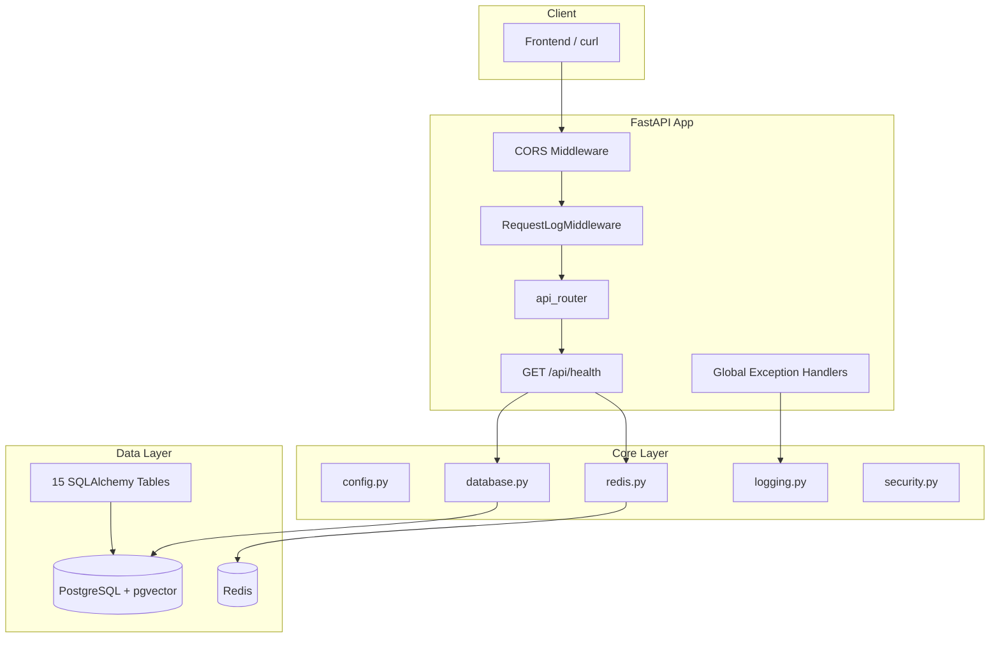

# Phase 0 后端实施计划

> **关联文档**：[development.md](development.md)  
> **状态**：已完成（2026-07-13）

## 当前状态

- 开发规格见 [development.md](development.md)
- 目标：按文档第 19 节「代码生成优先级」从零生成完整脚手架，Phase 0 **不实现业务 API**，仅 `/api/health` 可用

## 架构概览

## 15 张数据表（9 个模型文件）

| 模型文件 | 表名 |
|---------|------|
| `app/models/user.py` | `users` |
| `app/models/agent.py` | `agents` |
| `app/models/tool.py` | `tools` |
| `app/models/knowledge.py` | `knowledge_bases`, `knowledge_documents`, `knowledge_chunks` |
| `app/models/model_provider.py` | `model_providers`, `model_usages` |
| `app/models/workflow.py` | `workflows`, `workflow_versions` |
| `app/models/template.py` | `templates` |
| `app/models/execution.py` | `executions`, `execution_nodes`, `logs` |
| `app/models/env_variable.py` | `env_variables` |

## 实施步骤（6 个阶段）

### 阶段 1：项目初始化与依赖 ✅

创建根目录工程文件，严格对齐 development.md §2–§3：

- `pyproject.toml` + `requirements.txt`
- `.env.example`、`.gitignore`
- `docker-compose.yml`、`Dockerfile`
- `README.md`

**产出**：`docker compose up -d db redis` 可启动基础设施。

---

### 阶段 2：Core 基础设施 ✅

按 §19 第 1 步，创建 `app/core/` 全部模块：`config`、`database`、`redis`、`logging`、`security`、`exceptions`。

---

### 阶段 3：ORM 模型层 ✅

按 §19 第 2 步：`base.py`、`enums.py`、9 个业务模型、`__init__.py` 导出。

**关键约束**：UUID 主键、字符串枚举、JSONB、Vector(1536)、外键 CASCADE（`tools.user_id` 例外 SET NULL）。

---

### 阶段 4：Pydantic Schema 层 ✅

按 §19 第 3 步：9 个领域 schema + `common.py` + `utils/pagination.py`。

---

### 阶段 5：中间件、路由与应用入口 ✅

- 中间件：CORS、请求日志、全局异常处理
- 路由：health + 9 个空 skeleton router
- `main.py` 挂载 `setup_cors()`

中间件顺序：CORS → RequestLog → 路由。

---

### 阶段 6：Alembic 迁移、测试与验收 ✅

- 配置 async `alembic/env.py`
- 初始迁移含 pgvector 扩展、HNSW 索引、env_variables 唯一约束
- `tests/test_health.py`、`tests/test_models.py`

## 验收清单

| 检查项 | 命令 / 方式 | 状态 |
|--------|------------|------|
| 服务启动 | `uvicorn app.main:app --reload` | ✅ |
| 健康检查 | `GET /api/health` → `status: healthy` | 需 Docker |
| Docker | `docker compose up -d` | 需本地 Docker |
| 迁移 | `alembic upgrade head` → 15 表 | 需 Docker |
| pgvector | `knowledge_chunks.embedding` 为 `vector(1536)` | 需 Docker |
| 结构化日志 | structlog 输出 method/path/status/duration | ✅ |
| CORS | OPTIONS 预检带 `Access-Control-Allow-Origin` | ✅ |
| 异常格式 | 422 返回 `{"error": {...}}` | ✅ |
| 测试 | `pytest tests/` 全通过 | ✅ |

## 风险与注意事项

1. **CORS**：`main.py` 须显式调用 `setup_cors(app)`
2. **pgvector**：迁移中须手动创建 extension 和 HNSW 索引
3. **枚举列**：使用 `Enum(MyEnum, native_enum=False)` 存字符串
4. **Fernet Key**：`.env` 中须为合法 base64 32 字节密钥
5. **Python 版本**：需 3.11+；`cryptography` 固定 `<49.0.0` 避免编译失败

## 完成定义

Phase 0 完成 = development.md §19 验证清单全部通过，目录结构与 §3 一致，9 个 v1 路由文件为空骨架待 Phase 1 填充。
