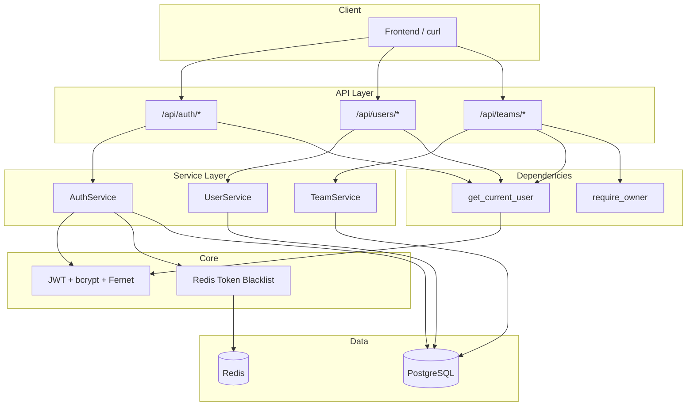

# Phase 1 后端实施计划 — 用户系统

> **关联文档**：[development.md](development.md)  
> **状态**：已完成（2026-07-13）  
> **前置条件**：[Phase 0](../phase0/implementation-plan.md) 脚手架已完成

## 当前状态

- 开发规格见 [development.md](development.md)
- 目标：实现完整用户系统（注册 / 登录 / Token 刷新 / 登出 / 个人资料 / 团队管理）
- 新增 1 张数据表（`teams`），扩展 `users` 表 5 个字段

## 架构概览



## 数据模型变更

| 变更类型 | 文件 / 表 | 说明 |
|---------|----------|------|
| 扩展 | `users` | 新增 `username`、`account_type`、`team_id`、`is_active` |
| 新增 | `teams` | 团队名、owner_id、invite_code |
| 新增 | `app/models/team.py` | Team ORM |
| 扩展 | `app/models/enums.py` | `AccountType` 枚举 |
| 迁移 | `002_phase1_user_system.py` | Alembic 迁移脚本 |

## 实施步骤（9 个阶段）

### 阶段 1：配置变更 ✅

- 修改 [`app/core/config.py`](../../app/core/config.py)：JWT 15min/30d、`bcrypt_rounds`、`team_max_members`、`invite_code_length`
- 修改 [`.env.example`](../../.env.example)：补充 Phase 1 配置项

---

### 阶段 2：枚举与模型 ✅

1. `app/models/enums.py` — 新增 `AccountType`
2. `app/models/user.py` — 扩展字段与 team 关系
3. `app/models/team.py` — 新建 Team 模型
4. `app/models/__init__.py` — 导出 team 模块

---

### 阶段 3：安全工具扩展 ✅

修改 [`app/core/security.py`](../../app/core/security.py)：

- `hash_password` / `verify_password`（bcrypt rounds 可配置）
- `validate_password_strength`
- `create_access_token` / `create_refresh_token`（含 `jti`、用户信息 payload）
- `generate_invite_code`（排除易混淆字符）
- `blacklist_token` / `is_token_blacklisted`（Redis）

---

### 阶段 4：Schema 定义 ✅

| 文件 | 内容 |
|------|------|
| `app/schemas/auth.py` | RegisterRequest、LoginRequest、RefreshRequest、ChangePasswordRequest |
| `app/schemas/user.py` | UserResponse、UserProfileResponse、UserUpdateRequest |
| `app/schemas/team.py` | TeamCreateRequest、JoinTeamRequest、TeamResponse、TeamMemberResponse |

成功响应统一包装：`{ "code": 0, "message": "success", "data": {...} }`

---

### 阶段 5：权限依赖 ✅

修改 [`app/api/deps.py`](../../app/api/deps.py)：

- `get_current_user` — JWT 解析 + 黑名单检查 + 用户状态校验
- `require_owner` — 团队 Owner 权限校验
- `get_current_team` — 可选团队信息依赖

---

### 阶段 6：服务层 ✅

| 文件 | 职责 |
|------|------|
| `app/services/auth_service.py` | 注册、登录、刷新 Token、登出 |
| `app/services/user_service.py` | 个人资料、修改密码 |
| `app/services/team_service.py` | 创建/加入/成员管理/删除团队 |

---

### 阶段 7：路由层 ✅

| 文件 | 路由前缀 | 端点数 |
|------|---------|--------|
| `app/api/v1/auth.py` | `/api/auth` | 4 |
| `app/api/v1/users.py` | `/api/users` | 3 |
| `app/api/v1/teams.py` | `/api/teams` | 6 |

修改 [`app/api/router.py`](../../app/api/router.py)：

- 新增 `/api/auth`、`/api/teams`
- 用户路由从 `/api/v1/users` 改为 `/api/users`

---

### 阶段 8：数据库迁移 ✅

```bash
alembic upgrade head   # 应用 002_phase1_user_system
```

迁移内容：
1. `users` 表新增 `username`、`account_type`、`team_id`、`is_active`
2. 新建 `teams` 表及外键索引
3. 已有用户 `username` 回填为 email `@` 前部分

---

### 阶段 9：测试 ✅

| 文件 | 覆盖范围 |
|------|---------|
| `tests/conftest.py` | db_session、client、test_user、team_owner、auth_headers |
| `tests/test_auth_register.py` | 注册 8 个用例 |
| `tests/test_auth_login.py` | 登录 4 个用例 |
| `tests/test_auth_refresh.py` | Token 刷新 3 个用例 |
| `tests/test_users.py` | 用户资料 8 个用例 |
| `tests/test_teams.py` | 团队管理 8 个用例 |

## API 路由总表

| 方法 | 路径 | 描述 | 权限 |
|------|------|------|------|
| POST | `/api/auth/register` | 注册（个人/团队） | 公开 |
| POST | `/api/auth/login` | 登录 | 公开 |
| POST | `/api/auth/refresh` | 刷新 Token | refresh_token |
| POST | `/api/auth/logout` | 登出（黑名单） | 需登录 |
| GET | `/api/users/me` | 获取当前用户 | 需登录 |
| PATCH | `/api/users/me` | 更新用户信息 | 需登录 |
| POST | `/api/users/me/change-password` | 修改密码 | 需登录 |
| POST | `/api/teams` | 创建团队 | 需登录（个人用户） |
| POST | `/api/teams/join` | 加入团队 | 需登录（个人用户） |
| GET | `/api/teams/members` | 成员列表 | Owner |
| DELETE | `/api/teams/members/{user_id}` | 移除成员 | Owner |
| POST | `/api/teams/invite-code/reset` | 重置邀请码 | Owner |
| DELETE | `/api/teams` | 删除团队 | Owner |

## 验收清单

| 检查项 | 命令 / 方式 | 状态 |
|--------|------------|------|
| 个人注册 | `POST /api/auth/register` account_type=personal | ✅ |
| 团队注册 | `POST /api/auth/register` account_type=team + team_name | ✅ |
| 登录 | `POST /api/auth/login` 返回 token | ✅ |
| 错误密码 | 返回 401 `INVALID_CREDENTIALS` | ✅ |
| Token 刷新 | `POST /api/auth/refresh` | ✅ |
| 登出黑名单 | 登出后原 token 不可用 | ✅ |
| 获取个人信息 | `GET /api/users/me` | ✅ |
| 修改用户名 | `PATCH /api/users/me` | ✅ |
| 修改密码 | `POST /api/users/me/change-password` | ✅ |
| 创建团队 | `POST /api/teams` | ✅ |
| 加入团队 | `POST /api/teams/join` + invite_code | ✅ |
| 成员管理 | GET/DELETE members | ✅ |
| 重置邀请码 | `POST /api/teams/invite-code/reset` | ✅ |
| 删除团队 | `DELETE /api/teams` | ✅ |
| 未登录 401 | 无 token 访问受保护接口 | ✅ |
| 非 Owner 403 | 普通成员访问 Owner 接口 | ✅ |
| pytest | `pytest tests/` 全通过 | 需 PostgreSQL + Redis |

## 风险与注意事项

1. **路由前缀变更**：用户 API 从 Phase 0 的 `/api/v1/users` 改为 `/api/users`
2. **Redis 依赖**：登出黑名单、Token 撤销检查依赖 Redis 可用
3. **测试数据库**：集成测试使用 `tangyuan_test` 库，需提前创建
4. **邀请码字符集**：排除 `0/O/1/I/L`，生成时使用大写
5. **登录安全**：不区分「用户不存在」与「密码错误」，统一返回 `INVALID_CREDENTIALS`
6. **双 commit**：服务层内 `db.commit()` 与 `get_db` 依赖的自动 commit 共存，属预期行为

## 本地启动（无 Docker）

```bash
source .venv/bin/activate

# 确保本地 PostgreSQL + Redis 已运行
alembic upgrade head
uvicorn app.main:app --reload --host 0.0.0.0 --port 8000
```

## 完成定义

Phase 1 完成 = development.md §16.5 验证清单全部通过，13 个 API 端点可用，用户可完成「注册 → 登录 → 创建/加入团队 → 管理团队」完整流程。
